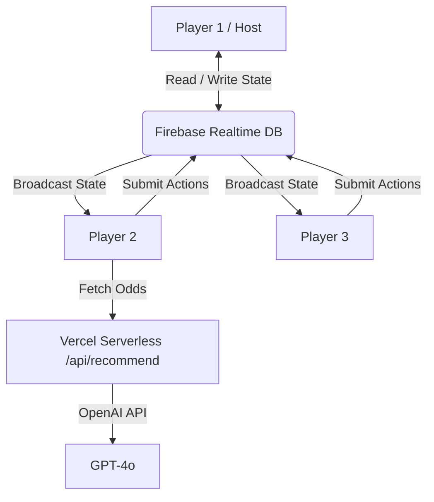

# Technical Specification Document (TSD)
## QuickPoker

### Overview
QuickPoker is a real-time, lightweight Texas Hold'em web application designed for mobile-first play. It eliminates the need for a complex proprietary poker server by leveraging **Firebase Realtime Database** for state synchronization and relying on the **Host Client** to run the game engine calculations. 

### Architecture

The architecture represents a "Host-Driven P2P-like Model over Centralized DB":
*   **Clients:** Web app running in browser (React / Vite).
*   **Host Client:** The player who creates the room runs all authoritative game logic in the background of their browser session.
*   **Database:** Firebase Realtime Database acts as a pub/sub dumb data store and single source of truth.
*   **Serverless Function:** A secure API routes ChatGPT OpenAI prompts to generate "AI Actions" without exposing API keys.



### Core Technologies
*   **Framework:** React 18 / Vite
*   **Styling:** Tailwind CSS (utility-first, responsive)
*   **Animations:** Framer Motion (chip movement, card dealing)
*   **State / Storage:** Firebase Realtime DB
*   **Global Client State:** Zustand
*   **Routing:** React Router DOM
*   **Hand Evaluation:** `pokersolver`
*   **AI Feature:** OpenAI API + Vercel Serverless Functions
*   **Audio:** Web Audio API (zero-latency synthesized beeps)

### Data Structure (`GameState`)

Firebase stores game rooms under `/games/{code}`.
The interface enforces a strict ledger: `TotalChipsInPlay = Round(Sum(balances) + Pot + Sum(SidePots))`.

```typescript
interface GameState {
    code: string;
    status: 'lobby' | 'playing' | 'finished';
    hostId: string;
    players: Record<string, Player>;
    playerOrder: string[]; 
    pot: number;
    sidePots: SidePot[];
    currentTurnId: string | null;
    dealerId: string | null;
    round: number;
    street: 'preflop' | 'flop' | 'turn' | 'river' | 'showdown';
...
```

### Edge Cases Handled
1.  **Strict Ledger Validation:** Ensures chips can never be duplicated. A watcher wraps state modifications and crashes if `Total == balances + pot` fails.
2.  **Host Migration:** Non-host participants monitor the host's `lastHostPing`. If the host goes offline for >15s, the next active player takes over host calculations automatically.
3.  **AFK Timer:** Host automatically folds a player on their turn if they stall for >45 seconds.
4.  **Side Pots:** Mathematically identical to real-life all-in split bucket distributions.

### Scalability Constraints
*   Firebase connections per room: Max 10 players.
*   Because the Host browser handles calculations, latency depends on the Host's connection to Firebase. However, poker is an asynchronous game, masking 100-300ms round trips perfectly.
